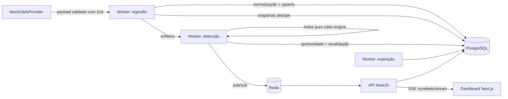

# Rataria — Agregação de odds e detecção de surebets

Sistema web profissional que agrega odds de provedores autorizados, detecta
**oportunidades matemáticas de arbitragem esportiva (surebets)**, calcula a
distribuição ideal da banca e exibe tudo em um dashboard com atualização em
tempo real.

> ⚠️ **Avisos importantes**
> - Odds mudam rapidamente e mercados podem ser suspensos a qualquer momento.
> - Casas aplicam regras e limites diferentes; o arredondamento pode eliminar a margem.
> - Uma oportunidade matemática detectada **não é garantia de lucro**. Apostas envolvem risco financeiro.
> - Verifique a legislação local e os termos das plataformas.
> - O sistema **não realiza apostas automaticamente** e não armazena credenciais de casas de apostas.

## Arquitetura



| Workspace | Papel |
|---|---|
| `packages/odds-engine` | Motor matemático puro (Decimal, determinístico, sem IO) |
| `packages/matching` | Matching de eventos puro (normalização, score explicável, regras eliminatórias) |
| `packages/provider-sdk` | Contrato `OddsProvider`, dois mocks determinísticos, registry |
| `packages/database` | Prisma + migrações + seed |
| `packages/shared` | Mercados canônicos, máquina de estados, validação de env |
| `apps/worker` | Filas BullMQ: ingestão → detecção → revalidação → expiração |
| `apps/api` | REST + SSE + OpenAPI (`/docs`) + autenticação/RBAC |
| `apps/web` | Dashboard (login, lista, detalhe, simulador, revisão de matching) |

## Pré-requisitos

- Node.js ≥ 20, pnpm ≥ 9
- Docker + Docker Compose (ou PostgreSQL 16 e Redis 7 locais)

## Deploy em produção (VPS)

Para publicar o sistema completo (dashboard + API + worker + PostgreSQL + Redis)
numa VPS com HTTPS automático, siga **`docs/DEPLOY.md`** — usa Docker Compose +
Caddy e só precisa de um domínio apontando para a VPS.

## Execução com Docker (recomendada)

```bash
cp .env.example .env
pnpm docker:up          # postgres + redis + migrações + seed + api + worker + web
# dashboard: http://localhost:3000 · API: http://localhost:3001 · docs: /docs
pnpm docker:down
```

## Execução local (sem Docker)

```bash
cp .env.example .env    # ajuste DATABASE_URL/REDIS_URL se necessário
pnpm install
pnpm db:generate && pnpm db:migrate && pnpm db:seed
pnpm --filter @rataria/worker dev   # terminal 1
pnpm --filter @rataria/api dev      # terminal 2
pnpm --filter @rataria/web dev      # terminal 3 → http://localhost:3000
```

Em ~15 s (um ciclo de ingestão) a surebet de demonstração aparece no
dashboard: mercado de tênis 2 vias com odds 2.10 (Bet Alpha) × 2.05
(Bet Bravo) → `Σ(1/odd) ≈ 0,9640` → margem ≈ **3,73%**. Os mercados de
futebol (1X2 e totais) das fixtures **não** têm arbitragem — de propósito.

## Testes e qualidade

```bash
pnpm test        # unitários + integração (integração exige DATABASE_URL/REDIS_URL)
pnpm lint
pnpm typecheck
pnpm build
```

## Como funciona o motor (resumo)

- `inverseSum = Σ(1/odd_i)`; existe arbitragem quando `inverseSum < 1` (estrito).
- `stake_i = banca × (1/odd_i)/inverseSum` equaliza os retornos.
- As stakes são arredondadas ao incremento e **todos os cenários são
  recalculados**; a viabilidade é decidida pelo **pior lucro** pós-arredondamento.
- Toda oportunidade carrega explicação auditável (fórmula, fatores do
  confidence score, plano de stakes) e histórico de revalidações.
- O confidence score (0–100) mede **confiança operacional** (idade das odds,
  casas envolvidas, proximidade do evento) — nunca probabilidade de lucro.

## Como adicionar um provedor

1. Implemente `OddsProvider` (`packages/provider-sdk/src/contract.ts`).
2. Valide o payload com `providerOddsPayloadSchema` (a ingestão já valida).
3. Registre no `ProviderRegistry` em `apps/worker/src/main.ts`.
4. Insira o registro do provedor no seed (`packages/database/src/seed.ts`).

Adaptadores não podem conter lógica de arbitragem.

## Como funciona o matching (multi-provedor)

Quando dois provedores descrevem o mesmo evento com nomes/horários/ordem
diferentes, o pipeline associa as representações a um evento canônico:

1. **Normalização** preserva o original e gera uma forma comparável (minúsculas,
   sem acentos, pontuação controlada, abreviações, sufixos removíveis).
2. **Geração de candidatos (blocking)**: mesmo esporte + janela de horário.
3. **Features** determinísticas: similaridade de participantes (direta e
   cruzada para ordem invertida), competição, país, diferença de horário, aliases.
4. **Regras eliminatórias** prevalecem sobre o texto: esporte/data/categoria/
   competição incompatíveis forçam rejeição, mesmo com nomes idênticos.
5. **Score** (0–100, versionado) decide: ≥85 aprova automaticamente, ≥60 vai
   para **revisão manual**, abaixo rejeita.

Odds só se combinam entre eventos com associação **aprovada** (automática ou
manual). Eventos em revisão não têm odds persistidas; a ordem invertida é
tratada explicitamente e remapeia as seleções HOME/AWAY (ver ADRs 0007–0010).

A tela **Revisão de matching** (`/matching`) exibe os casos ambíguos com as
diferenças destacadas e a explicação vinda da API. As ações de aprovar/rejeitar
usam proteção temporária (`ENABLE_UNAUTHENTICATED_MATCH_REVIEW`, falha em
produção) até a autenticação da Fase 7.

## Como adicionar um mercado

1. Adicione o tipo em `MARKET_TYPES` e seus resultados em `MARKET_OUTCOMES`
   (`packages/shared`) — é a fonte de verdade de "mercado completo".
2. Adicione o enum no schema Prisma + migração.
3. O pipeline e o motor passam a suportá-lo sem mudanças (a detecção usa
   `MARKET_OUTCOMES`).

## Documentação

- Plano e status: `docs/IMPLEMENTATION_PLAN.md`, `docs/PROJECT_STATUS.md`
- Decisões arquiteturais: `docs/adr/`
- Regras de engenharia: `.claude/rules/`

## Autenticação e papéis (Fase 7)

- Cadastro/login em `/login` e `/register`. Argon2id, JWT curto (15m) e refresh
  token rotativo (hash persistido, detecção de reuso). A sessão renova sozinha.
- Papéis: **USER** (leitura), **ANALYST**/**ADMIN** (decidem revisões de
  matching). O gate vale no backend (RBAC) e no frontend (botões).
- Para criar um admin local: cadastre um usuário e promova-o
  (`UPDATE "User" SET role='ADMIN' WHERE email='...';`), ou defina
  `SEED_ADMIN_EMAIL`/`SEED_ADMIN_PASSWORD_HASH` no seed.
- `JWT_SECRET` é obrigatório e forte (≥ 32 chars) em produção — a API falha na
  inicialização caso contrário.

## Segurança

Argon2id; JWT HS256 curto com `jti`; refresh opaco com apenas o hash
persistido; rate limiting (Helmet + throttler); CORS restrito ao `WEB_ORIGIN`;
validação Zod em toda entrada; segredos só via env validado. Detalhes em
`.claude/rules/security.md` e `docs/adr/0013-autenticacao-e-rbac.md`.

## Limitações atuais e roadmap

- Refresh token em `localStorage` com auto-refresh; produção deve migrar para
  cookie HttpOnly atrás de mesma origem/reverse proxy (ADR-0013).
- Alertas (Fase 9) e hardening/observabilidade completa — /metrics, retenção de
  snapshots, e2e no CI (Fase 10) — pendentes.
