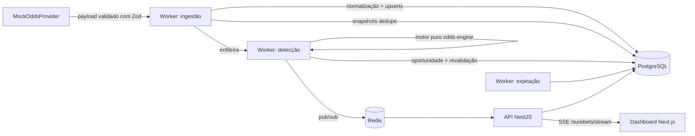

# Rataria — Agregação de odds e detecção de surebets

Sistema web profissional que agrega odds de provedores autorizados, detecta
**oportunidades matemáticas de arbitragem esportiva (surebets)**, calcula a
distribuição ideal da banca e exibe tudo em um dashboard com atualização em
tempo real.

> ⚠️ **Avisos importantes**
> - Odds mudam rapidamente e mercados podem ser suspensos a qualquer momento.
> - Casas aplicam regras e limites diferentes; o arredondamento pode eliminar a margem.
> - Uma oportunidade matemática detectada **não é garantia de lucro**. Apostas envolvem risco financeiro.
> - Verifique a legislação local e os termos das plataformas.
> - O sistema **não realiza apostas automaticamente** e não armazena credenciais de casas de apostas.

## Arquitetura



| Workspace | Papel |
|---|---|
| `packages/odds-engine` | Motor matemático puro (Decimal, determinístico, sem IO) |
| `packages/provider-sdk` | Contrato `OddsProvider`, mock determinístico, registry |
| `packages/database` | Prisma + migrações + seed |
| `packages/shared` | Mercados canônicos, máquina de estados, validação de env |
| `apps/worker` | Filas BullMQ: ingestão → detecção → revalidação → expiração |
| `apps/api` | REST + SSE + OpenAPI (`/docs`) |
| `apps/web` | Dashboard (lista, detalhe, simulador de banca) |

## Pré-requisitos

- Node.js ≥ 20, pnpm ≥ 9
- Docker + Docker Compose (ou PostgreSQL 16 e Redis 7 locais)

## Execução com Docker (recomendada)

```bash
cp .env.example .env
pnpm docker:up          # postgres + redis + migrações + seed + api + worker + web
# dashboard: http://localhost:3000 · API: http://localhost:3001 · docs: /docs
pnpm docker:down
```

## Execução local (sem Docker)

```bash
cp .env.example .env    # ajuste DATABASE_URL/REDIS_URL se necessário
pnpm install
pnpm db:generate && pnpm db:migrate && pnpm db:seed
pnpm --filter @rataria/worker dev   # terminal 1
pnpm --filter @rataria/api dev      # terminal 2
pnpm --filter @rataria/web dev      # terminal 3 → http://localhost:3000
```

Em ~15 s (um ciclo de ingestão) a surebet de demonstração aparece no
dashboard: mercado de tênis 2 vias com odds 2.10 (Bet Alpha) × 2.05
(Bet Bravo) → `Σ(1/odd) ≈ 0,9640` → margem ≈ **3,73%**. Os mercados de
futebol (1X2 e totais) das fixtures **não** têm arbitragem — de propósito.

## Testes e qualidade

```bash
pnpm test        # unitários + integração (integração exige DATABASE_URL/REDIS_URL)
pnpm lint
pnpm typecheck
pnpm build
```

## Como funciona o motor (resumo)

- `inverseSum = Σ(1/odd_i)`; existe arbitragem quando `inverseSum < 1` (estrito).
- `stake_i = banca × (1/odd_i)/inverseSum` equaliza os retornos.
- As stakes são arredondadas ao incremento e **todos os cenários são
  recalculados**; a viabilidade é decidida pelo **pior lucro** pós-arredondamento.
- Toda oportunidade carrega explicação auditável (fórmula, fatores do
  confidence score, plano de stakes) e histórico de revalidações.
- O confidence score (0–100) mede **confiança operacional** (idade das odds,
  casas envolvidas, proximidade do evento) — nunca probabilidade de lucro.

## Como adicionar um provedor

1. Implemente `OddsProvider` (`packages/provider-sdk/src/contract.ts`).
2. Valide o payload com `providerOddsPayloadSchema` (a ingestão já valida).
3. Registre no `ProviderRegistry` em `apps/worker/src/main.ts`.
4. Insira o registro do provedor no seed (`packages/database/src/seed.ts`).

Adaptadores não podem conter lógica de arbitragem.

## Como adicionar um mercado

1. Adicione o tipo em `MARKET_TYPES` e seus resultados em `MARKET_OUTCOMES`
   (`packages/shared`) — é a fonte de verdade de "mercado completo".
2. Adicione o enum no schema Prisma + migração.
3. O pipeline e o motor passam a suportá-lo sem mudanças (a detecção usa
   `MARKET_OUTCOMES`).

## Documentação

- Plano e status: `docs/IMPLEMENTATION_PLAN.md`, `docs/PROJECT_STATUS.md`
- Decisões arquiteturais: `docs/adr/`
- Regras de engenharia: `.claude/rules/`

## Limitações atuais e roadmap

- Um único provedor (mock); matching probabilístico multi-provedor é a Fase 4.
- Sem autenticação ainda (Fase 7) — não exponha a API publicamente.
- Alertas (Fase 9) e hardening/observabilidade completa (Fase 10) pendentes.
